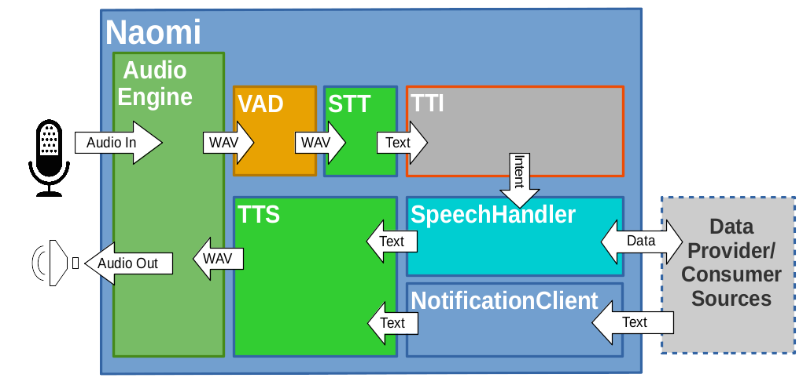

<h1 class="welcome">Welcome to Naomi!</h1>

The Naomi Project is an open source, technology agnostic platform for developing always-on, voice-controlled applications!

Naomi **software** integrates within a framework an array of functionality supporing text-to-speech & speech-to-text systems, plugins and recognition technologies into a single solution.
It provides uniform user interfaces, and a common approach for developing always-on, voice-controlled applications, regardless of the number of devices and sub-systems involved.

The Naomi documentation contains extensive resources to meet the needs of all users.   
- If you are new to Naomi, we recommend learning a bit about Naomi first by going to the guided learning section at [Getting Started](#getting-started) below!
- If you're a generally experienced user and wish to dive right it then proceed to the [Download](/download/) page contains links and installation instructions. The [Manual Configuration Guide](./configuration/) also contain useful follow on information to manually configure Naomi plugins. 
- Experienced Naomi user looking for the documentation on a specific plugins, go to the [Naomi Plugin Exchange](/plugins/). You can also use the search box above to find any page on this site.
- If you would like to contribute to the development of Naomi, please refer to our [Developer Guide](./developer/).

This documentation is always worked on, so expect regular changes. If you feel that something important is missing, please [help us improve the documentation](https://github.com/naomiproject/naomi-docs/blob/gh-pages/README.md#contributing-to-the-documentation)!

### Releases
Naomi releases are divided into three group:
- **Stable** versions (**{{$page.frontmatter.currentVersion}}**) are thoroughly tested semi-annual official releases of Naomi. Use the stable version for your production environment if you don't need the latest enhancements and prefer a robust system.
- **Milestone** versions (**{{$page.frontmatter.currentMilestoneVersion}}**) are intermediary releases of the next Naomi version, released about once a month, and they include the new recently added features and bugfixes. They are a good compromise between the current stable version and the bleeding-edge and potentially unstable nightly version. Milestones releases are **Highly Recommended** for most users.
- **Nightly** versions are at most 1 or 2 days old and include the latest code. Use nightly for testing out very recent changes, but be aware some nightly versions might be unstable. Use in production at your own risk!

The docs are divided into two catagories, Stable & Dev, Stable docs matching version **{{$page.frontmatter.currentVersion}}** release and Dev matching version **{{$page.frontmatter.currentMilestoneVersion}}** release. This is represented by the dropdown at the **Top Right** of any documentation pages. Please verify you are viewing the same doc version as your Naomi installation. All past version documentation is archived on our [support site](https://support.projectnaomi.com/document/) to view if need be.

## Getting Started
- To gain some overall understanding of Naomi's structure and operation a top down view can be found in the section [Architecture Overview](#architecture-overview)  
- Naomi has been developed in a Debian environment with some emphasis on the Raspberry Pi (RPi) platform, although in theory should run on other environments that include Python, i.e Linux, Windows and Mac OSx but as yet remains untested on these.
You can find specific installation instructions for tested platforms in the [Installation Guide](./installation/).
- Many people find that the simplest way to experiment with Naomi is to get a [Raspberry Pi](https://raspberrypi.org) and install [Naobian](./installation/naobian/) OS, an all in one Raspberry Pi OS with Naomi preloaded. This is the most "hassle-free Naomi setup".
While Naobian offers a streamlined and simplified way to get up and running quickly, it is a complete platform for developing always-on, voice-controlled applications.
- Once installed you may proceed to the [Setup and Usage](./setup/index/) section to get Naomi running and "talking up a storm"!.

Along the way, you may have some questions; the [Naomi Community](#The-Naomi-Community) is here to help.

## The Naomi Community

Naomi is not just software - it is also a **community** of users, contributors and maintainers, working together on an open-source, interoperable approach to virtual assistance.
The center of this community is the [Naomi community forum](https://support.projectnaomi.com).
You can search previous conversations and issues to see if your question has already been answered.
You can post your own question as well (although it is generally considered to be good etiquette to check fairly thoroughly before posting).
One of the great things about Naomi is that it has an active and responsive community of developers and maintainers who generally respond quite quickly to forum questions.
We believe you will find that our community works diligently to make newcomers feel at home.

## Architecture Overview

Naomi is developed in [Python](https://www.python.org/) and mainly based on the [Jasper](https://jasperproject.github.io/) framework.

Naomi is highly modular software that can be extended through "Plugins" installed in any of the module blocks in the architectural diagram below.
Plugins give Naomi a wide array of capabilities, from User Interfaces, to the ability to interact with a large and growing number of physical things.
Plugins may come with the Naomi distribution or be created and installed by the user in their Naomi instance.

The overall architecture of Naomi is shown in the figure below:

  

The Naomi container provides an infrastructure to control and coordinate the interaction of a collection of program modules that deliver the overall funcationality to collect and respond to speech.

**AudioEngine** This module provides Naomi a facility for input and output voice interaction with the user and the internal system. It take the external voice input and makes it available in a format accessible for processing while also taking any converted system output text and speaking it to the user.

**VAD** The Voice Activity Detection module filters the input and identifies the difference between speech and ambient noise.

**STT** Speech To Text takes the raw speech input and coverts it, based on the defined vocabulary, into word units which can then be analyzed for semantic meaning by the TTI.

**TTI** The Text To Intent module takes the individual word inputs and attempts to extract the meaning/intent based on their organizational structure. It uses the defined standard words and phrases (i.e. phrases that occur frequently in normal conversations) to determine the appropriate intent to activate and then pass the most likely intent input to the handler module.

**SpeechHandler** The Speechhandler modules uses its class of plugins to allow Naomi to perform actions in response to user input. The plugins are like "apps" that implement Naomi's "skills". a term often used in the industry for them. The module uses the intent input to activate the particular plugin which implements the required "skill" functionality. It will optionally interact with the user and/or the external Data/Service Provider Cloud, such as an email server, to fulfil the required intent.

**NotificationClient** This module also handles plugin based "skills" in a manner similar to the SpeechHandler. The major difference between the two types of plugin is that the speechhandler only responds to conversations you initiate, while the NotificationClient allows Naomi to initiate a conversation. They are the Naomi equivalent of a cron job or scheduled task.

**TTS** The Text To Speech accepts text input from other modules and coverts it to speech which is consumed by the AudioEngine and output to the user

<DocPreviousVersions/>
<EditPageLink/>
