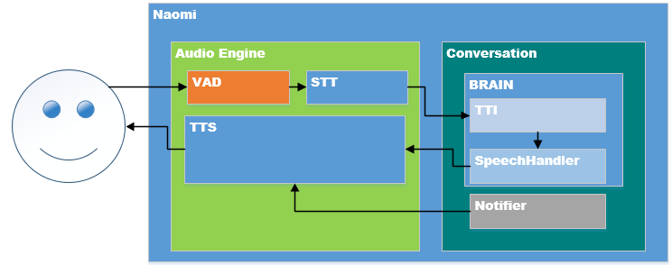

# About Naomi

Naomi **software** integrates different home text-to-speech & speech-to-text systems, plugins and technologies into a single solution.
It provides uniform user interfaces, and a common approach for developing always-on, voice-controlled applications, regardless of the number of devices and sub-systems involved.

## Getting Started

We highly recommend that you read the next chapter titled [Concepts](/concepts/index.html).
It introduces a number of important ideas that will help you as you install and begin to configure Naomi for the first time.

Naomi runs on many popular platforms including Linux, Windows and macOS.
You can find specific installation instructions for these and other platforms in the [Installation Overview](/installation/index.html) article.
Many people find that the simplest way to experiment with Naomi is to get a [Raspberry Pi](https://raspberrypi.org) and install [naobian](/installation/naobian.html); a "hastle-free Naomi setup".
While Naobian offers a streamlined and simplified way to get up and running quickly, it is a complete open source platform for developing always-on, voice-controlled applications.

Once you have Naomi up and running, the [Configuration](/configuration/index.html) article contains everything you need to know to get your Naomi installation telling you information around your home.
You can use [Sitemaps](/configuration/sitemaps.html) to control how the status of the information are displayed on different Naomi User Interfaces, and you can begin to experiment with [Rules](/configuration/rules-dsl.html) in order to get the most out of your installation.

Along the way, you may have some questions; the Naomi community is here to help.

## The Naomi Community

Naomi is not just software - it is also a **community** of users, contributors and maintainers, working together on an open source platform for developing always-on, voice-controlled applications.
The center of this community is the [Naomi community forum](https://community.projectnaomi.com).
You can search previous conversations and issues to see if your question has already been answered.
You can post your own question as well (although it is generally considered to be good etiquette to check fairly thoroughly before posting).
One of the great things about Naomi is that it has an active and responsive community of developers and maintainers who generally respond quite quickly to forum questions.
We believe you will find that our community works diligently to make newcomers feel at home.

## Naomi Structure

Naomi is developed in [Python](https://www.python.org/) and mainly based on the [Jasper](https://jasperproject.github.io/) framework.
[Jetty](https://www.eclipse.org/jetty/) is used as an HTTP server.

Naomi is highly modular software that can be extended through "Plugins".
Plugins give Naomi a wide array of capabilities, from User Interfaces, to the ability to interact with a large and growing number of physical Things.
Plugins may come from the Naomi distribution.

The overall architecture of Naomi is shown in the figure below:

